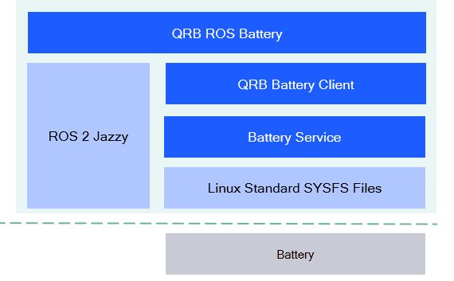

<div align="center">
  <h1>QRB ROS Battery</h1>
  <p align="center">
    
  </p>
  <p>ROS Packages for Battery State on Qualcomm Robotics Platforms</p>

  <a href="https://ubuntu.com/download/qualcomm-iot" target="_blank"></a>
  <a href="https://docs.ros.org/en/jazzy/" target="_blank"></a>

</div>

---

## 👋 Overview

The [QRB ROS Battery](https://github.com/qualcomm-qrb-ros/qrb_ros_battery) is a ROS package that publishes battery state data from system node.

<div align="center">
  
</div>

<br>

The [`qrb_ros_battery`](https://github.com/qualcomm-qrb-ros/qrb_ros_battery/tree/main/qrb_ros_battery) is a ROS 2 package. It creates a publisher to publish battery state data from system node.

The [`qrb_battery_client`](https://github.com/qualcomm-qrb-ros/qrb_ros_battery/tree/main/qrb_battery_client) is a C++ library, it provides APIs to `qrb_ros_battery` for querying battery state data from lower layer `Battery Service`.

The `Battery Service` is a background service designed to provide APIs for client-side access and get battery state data.

## 🔎 Table of contents
- [APIs](#-apis)
- [Supported targets](#-supported-targets)
- [Installation](#-installation)
- [Usage](#-usage)
- [Build from source](#-build-from-source)
- [Contributing](#-contributing)
- [Contributors](#️-contributors)
- [FAQs](#-faqs)
- [License](#-license)

## ⚓ APIs

### 🔹 `qrb_ros_battery` APIs

<table>
  <tr>
    <th>Interface</th>
    <th>Name</th>
    <th>Type</th>
    <td>Description</td>
  </tr>
  <tr>
    <td>Publisher</td>
    <td>/battery_stats</td>
    <td>sensor_msgs/msg/BatteryState</td>
    <td>output battery status data</td>
  </tr>
</table>

### 🔹 `qrb_battery_client` APIs

<table>
  <tr>
    <th>Function</th>
    <th>Parameters</th>
    <th>Description</th>
  </tr>
  <tr>
    <td>bool init_connection()</td>
    <td>Empty</td>
    <td>Connect with battery service, return <b>true</b> means init successfully.</td>
  </tr>
  <tr>
    <td>void close_connection()</td>
    <td>Empty</td>
    <td>Disconnect with battery service.</td>
  </tr>
  <tr>
    <td>bool get_battery_stats(std::unique_ptr<std::string> & msg)</td>
    <td>
      <b>msg</b>: Pointer to battery status info
    </td>
    <td>Get battery status. Returns <b>true</b> if successful. If <b>true</b>, <b>msg</b> will point to the latest battery info.</td>
  </tr>
</table>

## 🎯 Supported targets

<table >
  <tr>
    <th>Development Hardware</th>
    <td>Qualcomm Dragonwing™ RB3 Gen2</td>
  </tr>
  <tr>
    <th>Hardware Overview</th>
    <th><a href="https://www.qualcomm.com/developer/hardware/rb3-gen-2-development-kit"></a></th>
  </tr>
</table>

---

## ✨ Installation

> [!IMPORTANT]
> **PREREQUISITES**: The following steps need to be run on **Qualcomm Ubuntu** and **ROS Jazzy**.<br>
> Reference [Install Ubuntu on Qualcomm IoT Platforms](https://ubuntu.com/download/qualcomm-iot) and [Install ROS Jazzy](https://docs.ros.org/en/jazzy/index.html) to setup environment. <br>
> For Qualcomm Linux, please check out the [Qualcomm Intelligent Robotics Product SDK](https://docs.qualcomm.com/bundle/publicresource/topics/80-70018-265/introduction_1.html?vproduct=1601111740013072&version=1.4&facet=Qualcomm%20Intelligent%20Robotics%20Product%20(QIRP)%20SDK) documents.

Add Qualcomm IOT PPA for Ubuntu:

```bash
sudo add-apt-repository ppa:ubuntu-qcom-iot/qcom-noble-ppa
sudo add-apt-repository ppa:ubuntu-qcom-iot/qirp
sudo apt update
```

Install Debian package:

```bash
sudo apt install ros-jazzy-qrb-ros-battery qcom-battery-service
```

## 🚀 Usage

### Start the battery node

```bash
source /opt/ros/jazzy/setup.bash
ros2 run qrb_ros_battery battery_node
```
The output for these commands:

```bash
[INFO] [1756720182.917875184] [battery_stats_publisher]: Started Battery Node
...
```

Then you can check ROS topics with the topic `/battery_stats`.

```bash
ros2 topic list
/battery_stats
```

### The output of the topic

Here just a example for the topic output.

```bash
header:
  stamp:
      sec: 1756810050
      nanosec: 208103261
  frame_id: battery_stats
voltage: 4259866.0
temperature: 250.0
current: -134584.0
charge: 3360600.0
capacity: 100.0
design_capacity: -1.0
percentage: 100.0
power_supply_status: 2
power_supply_health: 1
power_supply_technology: 2
present: true
cell_voltage:
- 4259866.0
cell_temperature:
- 250.0
location: battery_stats
serial_number: battery_stats
```

---

## 👨‍💻 Build from source

### Dependencies
Install dependencies `ros-dev-tools`:

```bash
sudo add-apt-repository ppa:ubuntu-qcom-iot/qcom-noble-ppa
sudo add-apt-repository ppa:ubuntu-qcom-iot/qirp
sudo apt update

sudo apt install libdbus-1-dev \
  ros-dev-tools
```

### Build
Download the source code and build with colcon

```bash
source /opt/ros/jazzy/setup.bash
git clone https://github.com/qualcomm-qrb-ros/qrb_ros_battery.git
colcon build
```


## 🤝 Contributing

We love community contributions! Get started by reading our [CONTRIBUTING.md](CONTRIBUTING.md).<br>
Feel free to create an issue for bug report, feature requests or any discussion💡.

## ❤️ Contributors

Thanks to all our contributors who have helped make this project better!

<table>
  <tr>
    <td align="center"><a href="https://github.com/quic-zhanlin"><br /><sub><b>quic-zhanlin</b></sub></a></td>
    <td align="center"><a href="https://github.com/jiaxshi"><br /><sub><b>jiaxshi</b></sub></a></td>
    <td align="center"><a href="https://github.com/PadmanabhaKavasseri"><br /><sub><b>Padmanabha Kavasseri</b></sub></a></td>
  </tr>
</table>

## ❔ FAQs

<details>
<summary><strong>Why do I see the battery ros node exit with `invalid_argument` error?</strong></summary>

- Please ensure that the battery service is running.
</details>


## 📜 License

Project is licensed under the [BSD-3-Clause](https://spdx.org/licenses/BSD-3-Clause.html) License. See [LICENSE](./LICENSE) for the full license text.
